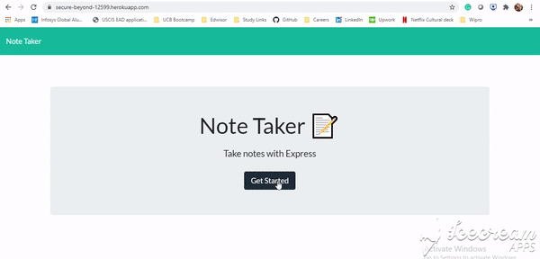

# Note-taker

An application that can be used to write, save, and delete notes. This application will use an express backend and save and retrieve note data from a JSON file. Here are the list of API:
- GET `*`
- GET `/notes`
- GET `/api/notes`
- POST `/api/notes`
- DELETE `/api/notes/:id`


```
Here is how the application works:
```



## Prerequisites

- git clone https://github.com/shambhawi13/Note-taker.git 
- node and npm installed
- navigate to folder where you cloned the application
- RUN node server.js
- open application on given port 8080
- Navigate to notes page and start creating your notes
- Link hoisted on Heroku can be used directly for creating notes if one wants the deployed link.


## Technologies Used
- JavaScript - Core logic
- Node and NPM
- Express
- FileSystems
- HTML
- Bootstrap
- Git - version control system to track changes to source code
- GitHub - hosts repository that can be deployed to GitHub Pages

## Installing

- Clone the repository : git clone https://github.com/shambhawi13/Note-taker.git  

## Authors

* **Shambhawi Kumari**
 [GitHub](https://github.com/shambhawi13/) | 
 [LinkedIn](https://www.linkedin.com/in/shambhawi-kumari/)


## Review URL

[GitHub](https://github.com/shambhawi13/Note-taker)
[Live](https://secure-beyond-12599.herokuapp.com/)
[Heroku-Git](https://git.heroku.com/secure-beyond-12599.git)


